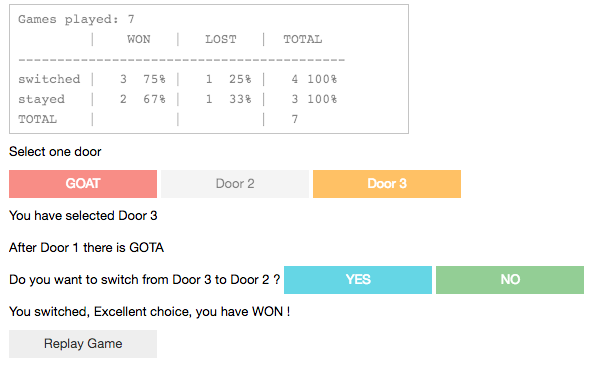

# Monty Hall problem

Solving dilemma should you change or not doors in Monty Hall game using hacker statistics.

The conclusion is: **in Monty Hall game you should always change doors**.

Thera are 2 scripts: `no_change.py` and `change.py`

`no_change.py` simulated 10000 Monty Hall games and calculates the probability of win/lose when there **IS NO changed of door**.

The output of `no_change.py`

<pre>
$ python3 no_change.py 
#################################
State | Number of games | Percent
Win   |            3286 |  32.86%
Lose  |            6714 |  67.14%
---------------------------------
SUM   |           10000 | 100.00%
</pre>

`change.py` simulated 10000 Monty Hall games and calculates the probability of win/lose when there **IS changed of door**.

The output of `change.py`

<pre>
$ python3 change.py 
#################################
State | Number of games | Percent
Win   |            6633 |  66.33%
Lose  |            3367 |  33.67%
---------------------------------
SUM   |           10000 | 100.00%
</pre>

#Interactive Game 

Interactive Game can be seen at:  

To run on a local machine:

<pre>
pipenv install jupyterlab
pipenv install ipywidgets
pipenv run jupyter lab
</pre>

**WARNING !!!**  
Code quality can be improved, do not use it for learning the best code quality practice.   
Sometimes there is no cost/benefit in improving code quality of simple scripts.